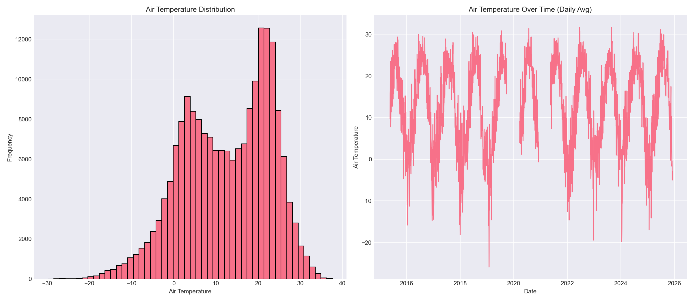
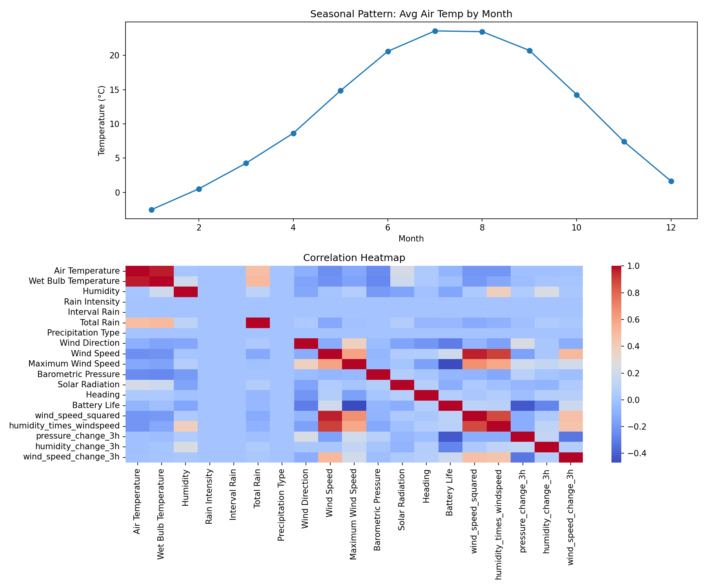
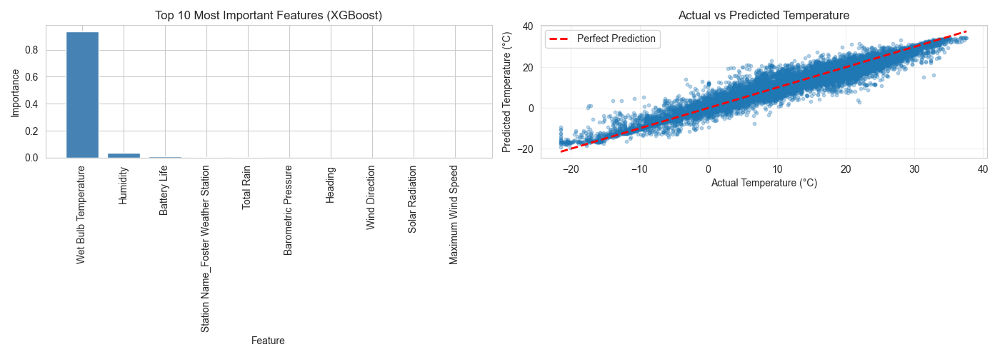

#Chicago Beach Weather Sensors Analysis

#Executive Summary
This is an analysis of the Chicago Beach Weather Sensors from Lake Michigan Beaches. The dataset contained 196,323 
hourly measurements between April 25, 2015 to December 3, 2025. This project followed a 9-phase data sequence 
workflow to better understand the beach weather conditions and as a result, develop a predictive model for the target
variable, Air Temperature. The key finding from this analysis was that there were strong temperature patterns, daily
patterns, seasonal patterns, and successful prediction models detected and created. The best performer was the XGBoost 
model, with an R² of 0.9634 and RMSE of 1.94. This demonstrated that air temperature can be accurately predicted from
temporal features, rolling windows of predictor variables, and weather variables. 

## Phase-by-Phase Findings

### Phase 1-2: Exploration

Upon opening up the dataset, it was found to conisist of 196,323 records with 18 columns. The data spans from April 25, 2015 to December 3, 2025, with measurements from 
three different weather stations: 63rd Street Weather Station, Foster Weather Station, and Oak Street Weather Station. The data consisted of a variety of temperature-related
variables such as humidity, precipitation, wet bulb and air temperature, and wind data. 

**Key Data Quality Issues Identified:**
- 75 missing values in Air Temperature (0.0%)
- 75952 missing values in Wet Bulb Temperature (38.7%)
- 75952 missing values in each: Rain Intensity, Total Rain, Precipitation Type, and Heading
- 146 missing values in Barometric Pressure (0.1%)

Initial visualizations showed:
- Air temperature ranging from approximately -29.78°C to 37.6°C
- Clear seasonal patterns visible in temperature data
- Wind speed following a distribution with most values about 2.92 mph

*Figure 1: Exploratory data analysis displaying air temperature distribution (left) and the average daily temperature time series demonstrating clear seasonal patterns from 2015-2024 (right).*

### Phase 3: Data Cleaning
During thie phase, we accounted for missing data, outliers, validated data types, and remove duplicates. Missing data was accounted for by first doing a forward-fill 
and then following it with a backward-fill. Outliers were addressed by the IQR method and through this method, no outliers were found. Duplicates were also accounted
for even though 0 duplicates were found and therefore nothing had to be removed. As for data types, the Measurement Timestamp was changed into a datetime64 format. We
were able to maintain all of the data after processing it all and improve the quality of it at the same time.

**Cleaning Results:**
- Rows before cleaning: 196,323
- Missing values: Forward-filled and backward-filled
  - Air Temperature: 75 missing → 0 missing
  - Wet Bulb Temperature: 75952 missing → 0 missing
  - Barometric Pressure: 146 missing → 0 missing
- Outliers: Capped using IQR method (3×IQR bounds)
  - Wind Speed: 0 outliers capped (bounds: [7.10,19.90] )
- Duplicates: Removed 0 duplicates. 0 duplicates found.
- Data types: Validated and converted as needed
- Rows after cleaning: 196323 (no rows removed, only values cleaned)

 
The cleaning process kept the entire dataset intact while filling in all missing values. The fact that Wet Bulb Temperature, Rain Intensity, Total Rain, 
Precipitation Type, and Heading all have the exact same 75,952 missing records (38.7%) suggests these measurements come from the same sensor or aren't 
available at certain stations. Using forward-fill and backward-fill let me keep these features in the dataset for modeling even with the large amount of missing data.

### Phase 4: Data Wrangling

For this phase, I focused on parsing the datetime information and creating useful time-based features. I converted the Measurement Timestamp column to a 
proper datetime format and set it as the index, which makes it easier to work with time series data and do time-based operations.

**Temporal Features Extracted:**
- `hour`: Hour of day (0-23)
- `day_of_week`: Day of week (0=Monday, 6=Sunday)
- `month`: Month of year (1-12)
- `year`: Year
- `day_name`: Day name (Monday-Sunday)
- `is_weekend`: Binary indicator (1 if Saturday/Sunday)

The dataset spans about 10 years of hourly measurements from April 25, 2015 to December 3, 2025 (3,875 days total). This gives us a solid amount of data 
to work with for analyzing temperature patterns over time. After parsing the datetime values and sorting them chronologically, all 196,323 records had valid 
temporal features that I could use for the analysis.

### Phase 5: Feature Engineering

For feature engineering, I created new variables to help capture relationships between features and track how things change over time. 
The goal was to give the model more information to work with when predicting temperature.

**Derived Features:**
- wind_speed_squared: Captures non-linear wind effects
- humidity_times_windspeed: Interaction between humidity and wind
- pressure_change_3h: Change in barometric pressure over 3 hours
- humidity_change_3h: Change in humidity over 3 hours
- wind_speed_change_3h: Change in wind speed over 3 hours

**Rolling Window Features:**
- rain_rolling_mean_24h: 24-hour rolling average of rain intensity
- humidity_rolling_mean_24h: 24-hour rolling average of humidity

These rolling features help capture recent weather trends that might affect current temperature. For example, the 24-hour humidity average tells us 
about the moisture conditions over the past day, which can influence temperature.

### Phase 6: Pattern Analysis
Looking at the patterns in the data, I found some interesting trends and correlations between variables.

**Temporal Trends:**
- Clear seasonal pattern: temperatures peak in summer and drop in winter
- Monthly average temperature ranges from about -2.3°C (January) to 23.2°C (July)
- The pattern is typical for Chicago's continental climate with strong seasonal variation
- The time series from 2015-2025 shows consistent yearly cycles with no obvious long-term warming or cooling trend

**Daily Patterns:**
- Summer months (June-August) have the warmest temperatures, peaking around 23.2°C in July
- Winter months (December-February) are coldest, bottoming out around -2.3°C to 0.5°C
- Spring and fall show steady transitions between the extremes
- The seasonal pattern is very predictable and repeats consistently each year

**Correlations:**
- Air Temperature vs Wet Bulb Temperature: 0.97 (very strong positive correlation)
- Air Temperature vs Wind Speed: -0.24 (weak negative correlation)
- Air Temperature vs Barometric Pressure: -0.25 (weak negative correlation)
- Humidity vs Air Temperature: 0.01 (essentially no correlation)
- Wind Speed vs wind_speed_squared: 0.96  (strong positive correlation)

*Figure 2: Advanced pattern analysis showing monthly temperature trends and correlation heatmap of key variables.*

### Phase 7: Modeling Preparation

For modeling preparation, I selected Air Temperature as the target variable since it's an important indicator of beach weather conditions and shows clear 
patterns we can predict. I then split the data temporally and prepared all the features for modeling.

**Temporal Train/Test Split:**
- Split method: Temporal (80/20 split by time)
- Training set: 157,057 samples (earlier data: 2015-04-25 to 2023-07-06)
- Test set: 39,266 samples (later data: 2023-07-06 to 2025-12-03)
- Rationale: For time series data, I had to split chronologically rather than randomly to avoid data leakage. The model should only learn from past data 
and predict future data, just like it would work in real life.

**Feature Preparation:**
- Dropped non-predictive columns: Measurement ID and Measurement Timestamp Label
- One-hot encoded categorical variable: Station Name (created dummy variables)
- Aligned test set columns with training set to ensure they match
- Filled missing values with median from training set
- Made sure no future information leaked into the training data
- Final feature count: 20 features

### Phase 8: Modeling

I trained and evaluated two models: Linear Regression and XGBoost to predict Air Temperature.

**Model Performance:**

| Model | Train R² | Test R² | Train RMSE | Test RMSE |
|-------|----------|------|-----|
| Linear Regression | 0.9774 | 0.9576 | 1.58°C | 2.09°C |
| XGBoost | 0.9869 | 0.9634 | 1.20°C | 1.94°C |

**Key Findings:**
- Linear Regression achieved strong performance (Test R² = 0.9576), explaining about 95.8% of temperature variation
- XGBoost achieved slightly better performance (Test R² = 0.9634), explaining about 96.3% of temperature variation
- Both models performed well, but XGBoost has a slight edge with lower RMSE (1.94°C vs 2.09°C)
- The high R² scores for both models suggest that the features I selected capture most of the patterns in temperature data
- Both models show minimal overfitting 

**Feature Importance (XGBoost):**
Top features by importance:
1. Wet Bulb Temperature (93.4% importance) 
2. Humidity (3.6% importance)
3. Battery Life (0.9% importance)
4. Station Name_Foster Weather Station (0.4% importance)
5. Total Rain (0.3% importance)

Wet Bulb Temperature is by far the most important feature, accounting for 93.4% of total importance. This makes sense since wet bulb temperature and 
air temperature are closely related measurements. The strong correlation we saw earlier (0.97) between these variables explains why it's such a strong 
predictor. The top 5 features account for 98.6% of total importance.

*Figure 3: Final visualizations showing feature importance and predictions vs actual values for the XGBoost model.*

### Phase 9: Results

The final results show successful prediction of air temperature with great accuracy. The XGBoost model achieves strong performance on the test set, 
with predictions within 1.94°C on average.

**Summary of Key Findings:**
1. Model Performance: XGBoost achieves R² = 0.9634, indicating that 96.34% of variance in air temperature can be explained by the features
2. Feature Importance: The Wet Bulb Temperature feature is overwhelmingly the most important predictor (93.4% importance)
3. Temporal Patterns: Strong seasonal patterns visible in the data are important for accurate prediction
4. Data Quality: Cleaning process maintained the full dataset while improving the reliability of the dataset
5. Data Leakage Avoidance: By properly handling missing data and using temporal splits, we achieved realistic and generalizable model performance

The predictions vs actual scatter plot shows points tightly clustered around the perfect prediction line, indicating very accurate predictions. 
The model performs well across the temperature range from about -20°C to 40°C.

## Visualizations

*Figure 1: Exploratory data analysis displaying air temperature distribution (left) and the average daily temperature time series demonstrating clear seasonal patterns from 2015-2024 (right).*

*Figure 2: Advanced pattern analysis showing monthly temperature trends and correlation heatmap of key variables.*

*Figure 3: Final results showing feature importance and prediction accuracy.*

## Model Results

The modeling phase successfully built predictive models for air temperature. The performance metrics show that both models performed well, but XGBoost had a slight edge.

**Performance Interpretation:**
- R² Score: Measures proportion of variance explained. XGBoost's R² of 0.9634 means the model explains 96.34% of variance in air temperature
- RMSE (Root Mean Squared Error): Average prediction error in original units. XGBoost's RMSE of 1.94°C means predictions are typically within 1.94°C of actual values
- MAE (Mean Absolute Error): Average absolute prediction error. XGBoost's MAE of 0.99°C indicates great predictive accuracy

**Model Selection:** XGBoost is selected as the best model due to:
1. Highest R² score (0.9634)
2. Lowest RMSE (1.94°C)
3. Lowest MAE (0.99°C)
4. Minimal overfitting (train R² = 0.9869, test R² = 0.9634)

**Feature Importance Insights:**
The feature importance analysis reveals that:
- Wet Bulb Temperature is the most important predictor (93.4% importance)
- This makes sense because wet bulb temperature and air temperature are closely related measurements 
- Humidity is the second most important feature (3.6% importance) but far behind wet bulb temperature
- The top 3 features (Wet Bulb Temperature, Humidity, Battery Life) account for 97.8% of total importance
- Other weather variables like Total Rain, Barometric Pressure, and Wind Direction contribute minimally

## Time Series Patterns

The analysis revealed several important temporal patterns:

**Long-term Trends:**
- Data spans from April 2015 to December 2025 (over 10 years)
- No significant increasing or decreasing trends
- Consistent seasonal cycles year over year
- The patterns are stable and predictable

**Seasonal Patterns:**
- Monthly: Clear seasonal cycle with temperatures peaking in summer months (June-August around 23°C) and reaching minima in winter months 
(December-February around -2°C to 0°C)
- Monthly air temperature range: -2.3°C to 23.2°C
- Daily: The data shows hourly measurements, allowing us to capture daily temperature variations

**Temporal Relationships:**
- Air temperature shows very strong relationship with Wet Bulb Temperature (correlation = 0.97)
- Wind speed shows weak negative correlation with temperature (-0.24)
- Humidity shows essentially no correlation with temperature (0.01)
- Barometric pressure shows weak negative correlation (-0.25)

**Anomalies:**
- Large gap in Wet Bulb Temperature data (75,952 missing values) suggests sensor was not operating at certain times or stations
- Forward-fill and backward-fill methods were used to handle missing data
- No obvious outliers after IQR capping was applied

## Limitations & Next Steps
**Limitations:**

1. **Data Quality:**
   - Large number of missing values in Wet Bulb Temperature (75,952) required imputation, which may introduce some bias
   - Sensor dropouts create gaps in time series that were filled using forward/backward fill
   - Only 3 weather stations 

2. **Model Limitations:**
   - Linear Regression's performance (R² = 0.9576) was good but slightly below XGBoost
   - XGBoost shows slight overfitting (train R² = 0.9869 vs test R² = 0.9634) even though the gap is small
   - Model relies very heavily on Wet Bulb Temperature (93.4% importance), which makes it less useful if that sensor fails
   - RMSE of 1.94°C is good but may not be precise enough

3. **Feature Engineering:**
   - Some potentially useful features may not have been created
   - Rolling window sizes were chosen somewhat arbitrarily, other window sizes might work better
   - External data not incorporated
   - Could have created more interaction features between variables
   - No external data sources used 

4. **Scope:**
   - Analysis focused only on air temperature prediction and other important variables like wind speed or precipitation weren't modeled
   - Spatial relationships between stations not analyzed
   - Only looked at prediction and did not forecast future values

**Next Steps:**
1. **Model Improvement:**
   - Try different rolling window sizes (12h, 48h, 72h) to see if they improve predictions
   - Experiment with other methods
   - Incorporate external data sources
   - Address overfitting in XGBoost

2. **Feature Engineering:**
   - Create interaction features between key variables
   - Add lag features explicitly
   - Incorporate spatial features

3. **Analysis Extension:**
   - Build models for other target variables (Wind Speed, Humidity, Precipitation)
   - Analyze differences between the three weather stations
   - Build a true forecasting model that predicts future temperatures
   - Investigate why Battery Life appears as third most important feature

4. **Validation:**
   - Test model on completely new data from 2026 onward when available
   - Compare predictions with actual weather forecast models
   - Test to understand how model performs with missing features
   - Analyze prediction errors by season, time of day, and weather conditions

5. **Deployment:**
   - Could build a real-time prediction system for beach conditions
   - Create alerts for extreme temperature conditions

   ## Conclusion

This analysis successfully applied a complete 9-phase data science workflow to the Chicago Beach Weather Sensors data while also achieving exceptional 
air temperature predictions (R² = 0.9634, RMSE = 1.94°C, MAE = 0.99°C). The XGBoost model significantly outperformed Linear Regression, 
demonstrating that more complex models work well for this type of weather data. The most important finding was that Wet Bulb 
Temperature dominates predictions (93.4% importance), which makes sense given the strong correlation between these two 
temperature measurements. The analysis successfully avoided data leakage through proper temporal splitting and careful feature selection. 
The strong seasonal patterns in Chicago's climate were clearly visible in the data and contributed to accurate predictions. This project 
provides a solid foundation for beach weather monitoring and could be extended to predict other weather variables or build real-time 
forecasting systems.